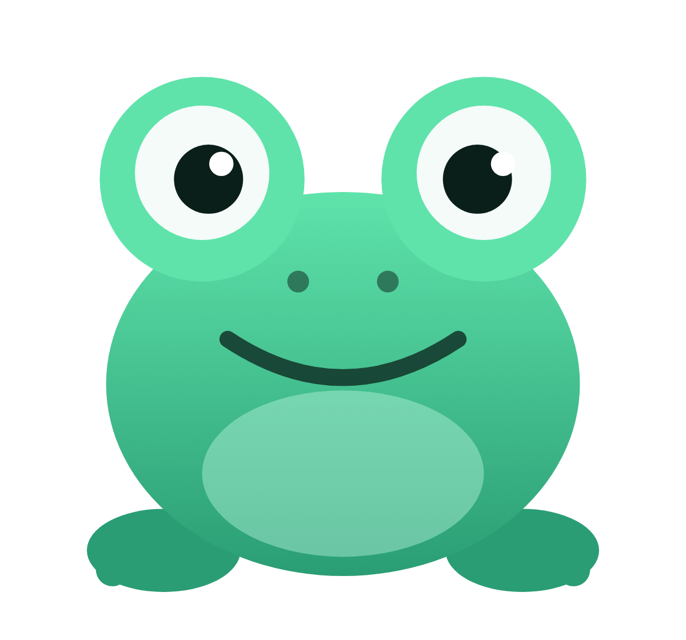
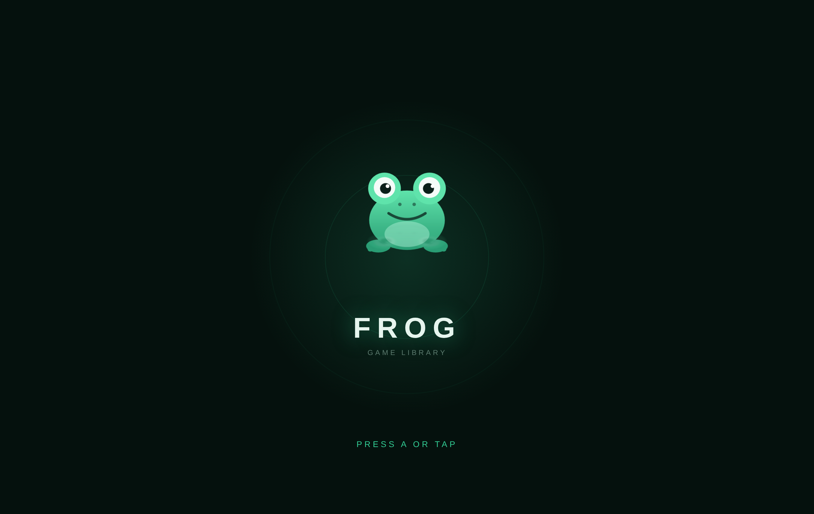
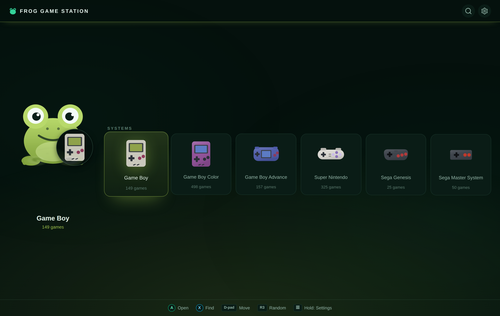
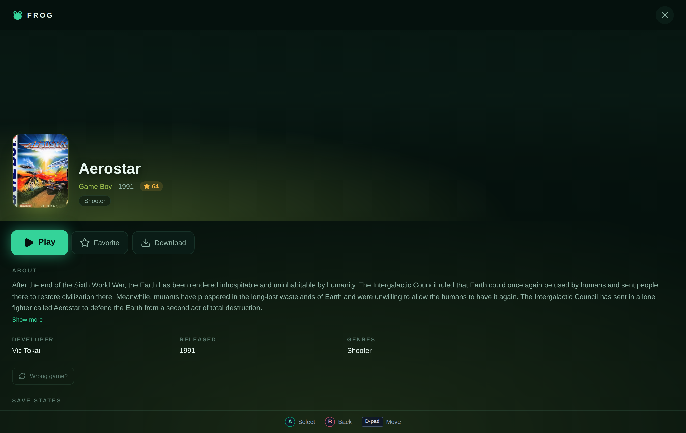
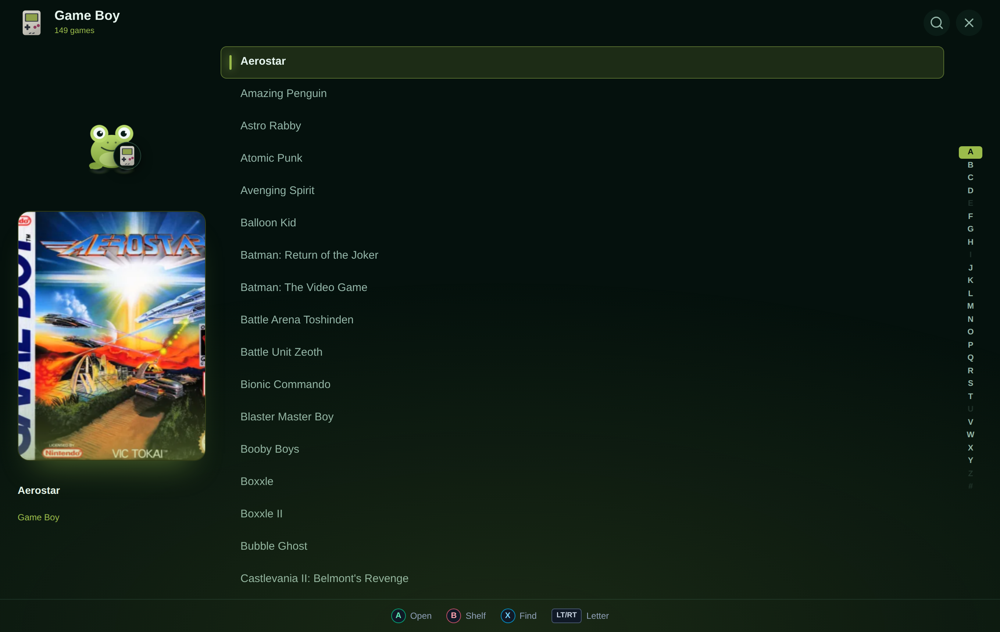
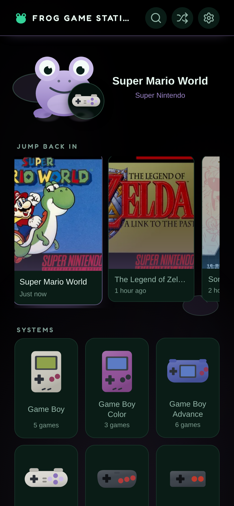
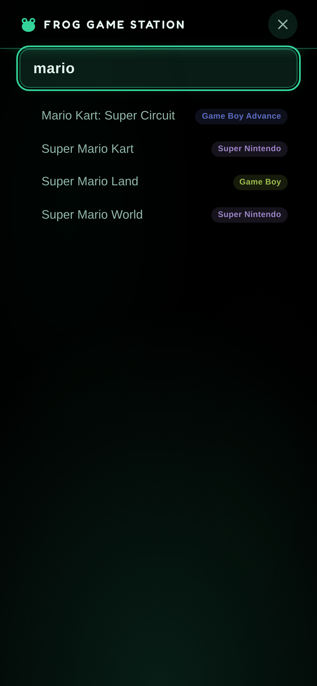

<p align="center">
  
</p>

<h1 align="center">Frog Game Station</h1>

<p align="center"><strong>A self-hosted games browser for your ROM library — play from the couch with a controller, or from your phone with your thumb.</strong></p>

<p align="center">
  <a href="https://github.com/BenGNelson/frog-game-station/actions/workflows/ci.yml"></a>
  
  
  
  
  
</p>

<p align="center"><em>AI-assisted build.</em></p>

Frog Game Station is a portfolio-quality, self-hosted web app that turns a folder of ROMs into a console-style library you can actually enjoy browsing. It's a *host* for your games: it organizes and enriches the collection, then hands the actual gameplay off to an isolated, in-browser [EmulatorJS](https://emulatorjs.org) frame. No installs, no per-game setup — point it at a folder and play.

## What it is

Most emulator front-ends pick one audience. Frog is built for two, as first-class citizens:

- **Couch + controller.** A five-screen, console-style UI you drive entirely with a gamepad (or keyboard): boot → shelf → game list → game page, with search reachable from anywhere. Rails, cursors, and a letter-at-a-time list keep hundreds of games one flick away.
- **Phone + thumb.** The exact same browser, touch-first: real tap targets on every tile and row, an on-screen keyboard for search, on-screen touch controls in the player, and an installable PWA so you can add it to your home screen and play downloaded games offline.

It has a hand-drawn **frog mascot** and a **WATER / jade dark theme** — a pond-and-lilypad motif where things float, reflect, and ripple. And it enriches each game with **[IGDB](https://www.igdb.com)** metadata (cover art, screenshots, summary, genres, rating) via a background matcher, so a bare filename becomes a real game page.

## Features

- **Five console-style screens** — boot, shelf, per-system game list, and a full game page, with search reachable anywhere. The shelf leads with "Jump back in" and Favorites, so most sessions never touch the alphabet. Click the right stick (R3, or `R`) for **"surprise me"** — a random title, from anywhere.
- **Rich IGDB metadata** — a background matcher pairs each ROM with its IGDB entry: a hero banner built from slowly crossfading screenshots, cover art, summary, genres, rating, and developer/publisher. Unmatched ROMs (a hack, or no key configured) degrade cleanly to a basic cover-and-title page — nothing ever looks broken.
- **"More like this"** — each game page suggests similar titles **from your own library**, using IGDB's similar-games list intersected with the ROMs you actually own, so every suggestion is one you can play.
- **Play-time + "Most played"** — Frog clocks how long you actually play each game (server-side, so it roams) and surfaces your most-played titles as their own shelf rail; each game page shows its total.
- **Collections & a finished flag** — mark games finished (a trophy badge everywhere the cover shows) and sort your library into free-form collections, each its own shelf rail. Server-side, so your collections and completion roam from the couch to your phone.
- **Set your own cover art** — grab the current frame mid-game ("Set as Cover" in the pause menu) and it becomes that game's box art everywhere — perfect for ROM hacks and titles with no match. Revert any time.
- **Save states + battery saves (SRAM)** — your in-game "Save → Continue" battery save roams and is backed up server-side; explicit save states are captured as snapshots (with a screenshot thumbnail) and relaunched from the game page. Rename, annotate, and pin your save states so the one you want is named and on top.
- **Offline play + installable PWA** — download games to your device, add Frog to your home screen, and play offline; the shelf, list, and search all fall back to your downloaded library automatically.
- **Full touch controls** — a from-scratch touch overlay with a real multi-touch d-pad (true diagonals), thumb-rolls between face buttons, and hit areas larger than the buttons, because thumbs undershoot.
- **Gamepad-native** — index-arithmetic navigation drives a controller, arrow keys, and a mouse through identical code. A boot "PRESS A" both wakes the controller (iOS won't report one until a button is pressed) and tells Frog to lay itself out for a pad or a thumb.
- **Drawn, not scraped** — console art is illustrated in-app (no official logos), so the collection has one coherent look and the repo stays publishable.
- **A settings screen** — check the IGDB matcher's status and trigger a re-scan, set the player input mode (auto / touch / pad), all controller- and touch-drivable from a header gear.

## Screenshots

<p align="center"></p>
<p align="center"><em>Turn it on — press A, or tap.</em></p>

<p align="center"></p>

The console-style home shelf — pick a system or jump back into a recent game, all
driven by a controller, the arrow keys, or a tap.

|  |  |
|---|---|
|  |  |
| **Game page** — rich IGDB data (summary, genres, rating, developer) with Play / Favorite / Download, plus a save-state shelf. | **Browse** — an alphabetical list with a letter rail and the resting mascot. |

### On a phone

<p align="center">
  
  &nbsp;&nbsp;&nbsp;
  
</p>

Touch-first and installable as a PWA — the same screens adapt from a controller to
a thumb, with an on-screen keyboard for search and touch controls in-game.

## Tech stack

- **Backend:** FastAPI — IGDB client + background matcher, ROM listing/streaming, cover proxy with WebP downscaling, save-state storage. (Python: FastAPI, uvicorn, requests, Pillow.)
- **Frontend:** React + Vite + Tailwind CSS, built to static assets and served by **nginx**.
- **Emulation:** [EmulatorJS](https://emulatorjs.org), loaded into an isolated client-side frame.
- **Metadata:** [IGDB](https://www.igdb.com) (via a Twitch OAuth app token).
- **Packaging:** Docker Compose — frontend + backend + nginx + a named `/data` volume. Installable PWA with offline support.

## Quick start

```bash
git clone <your-fork-url> frog-game-station
cd frog-game-station

# 1. Configure
cp .env.example .env
#    then edit .env:
#      - point GAMES_ROM_DIR at your ROM folder (mounted read-only)
#      - optionally add IGDB (Twitch) credentials for rich metadata

# 2. Fetch the EmulatorJS engine (~300MB, not committed)
scripts/fetch-emulatorjs.sh

# 3. Run it
docker compose up -d
```

Then open <http://localhost:8585> (or whatever you set `FRONTEND_PORT` to). On a fresh
install with no games yet, the shelf shows a quiet first-run screen that nudges you toward
the one or two things to set (`ROMS_DIR`, and IGDB credentials for cover art).

The EmulatorJS engine is **not** committed to the repo (it's large and pinned to v4.2.3). `scripts/fetch-emulatorjs.sh` downloads it into `frontend/public/emulatorjs/` (gitignored); alternatively the player can be pointed at the public CDN.

IGDB is optional. Without credentials, Frog runs fine — every game just shows the basic cover-and-title page. To enable rich metadata, register a free Twitch application and set `IGDB_CLIENT_ID` / `IGDB_CLIENT_SECRET` in `.env`.

## Configuration

All configuration lives in `.env` (copy it from `.env.example`; it is never committed). Secrets live only here.

| Variable | Default | Purpose |
|---|---|---|
| `FRONTEND_PORT` | `8585` | Host port the nginx frontend is published on. |
| `GAMES_ROM_DIR` | `./roms-sample` | Path to your ROM folder. Mounted **read-only** into the backend. |
| `IGDB_CLIENT_ID` | *(empty)* | Twitch app client ID for IGDB metadata. Empty = metadata dormant. |
| `IGDB_CLIENT_SECRET` | *(empty)* | Twitch app client secret. Secret — never commit. |
| `IGDB_SYNC_ENABLED` | `true` | Whether the background IGDB matcher runs (no-op without credentials). |
| `IGDB_SYNC_INTERVAL` | `3600` | Seconds between matcher passes. |

Backend internal port is `8000`, with the API mounted at `/api`. Data directories live under the `/data` volume:

| `/data` dir | Contents |
|---|---|
| `/data/frog.db` | SQLite database (IGDB matches, game progress, save-state index). |
| `/data/igdb-art/` | Cached, downscaled IGDB screenshots/cover art (WebP). |
| `/data/covers/` | Cached box-art thumbnails (WebP). |
| `/data/saves/` | Battery saves (SRAM) + explicit save states, one folder per game. |

## Production vs dev

- **Production** (baked images, served by nginx):

  ```bash
  docker compose up -d frontend backend
  ```

- **Hot-reload dev** (Vite dev server, live UI reload):

  ```bash
  docker compose --profile dev up frontend-dev
  ```

The frontend degrades gracefully when the backend is absent, so a lot of UI iteration can happen with just the dev server.

To run Frog as its **own installable PWA** (its own home-screen icon and offline scope), serve it at its own HTTPS origin — see [`docs/DEPLOY.md`](docs/DEPLOY.md).

## Testing

```bash
scripts/test.sh      # unit suites: pytest (backend) + vitest (frontend)
scripts/verify.sh    # e2e smoke: Playwright drives the app, checks pages render clean
```

## Project layout

```
frog-game-station/
├── backend/            # FastAPI app
│   ├── app/
│   │   ├── igdb.py         # IGDB client (Twitch OAuth + pure helpers)
│   │   ├── igdb_sync.py    # background IgdbMatcher daemon
│   │   ├── images.py       # WebP downscaling / thumbnail cache
│   │   ├── library.py      # ROM listing, streaming, cover matching
│   │   ├── db.py           # SQLite schema + accessors + migrations
│   │   ├── config.py       # settings from env
│   │   └── routers/        # API endpoints (mounted at /api)
│   └── tests/
├── frontend/           # React + Vite + Tailwind
│   ├── src/
│   │   ├── frog/           # the five screens + mascot art + theme
│   │   ├── player/         # EmulatorJS player shell + button legend
│   │   └── lib/            # nav, offline store, hooks, helpers
│   └── public/             # emulator.html, PWA manifest, (emulatorjs/ fetched)
├── e2e/                # Playwright smoke tests
├── scripts/            # test.sh, deploy.sh, verify.sh, fetch-emulatorjs.sh
└── docs/               # ARCHITECTURE.md, TODO.md
```

## Built on

- **[EmulatorJS](https://emulatorjs.org)** — the in-browser emulation engine that runs the games.
- **[IGDB](https://www.igdb.com)** — the games database behind the rich metadata.

Console art is drawn in-app; no official hardware logos or wordmarks are used.

## License

MIT.
