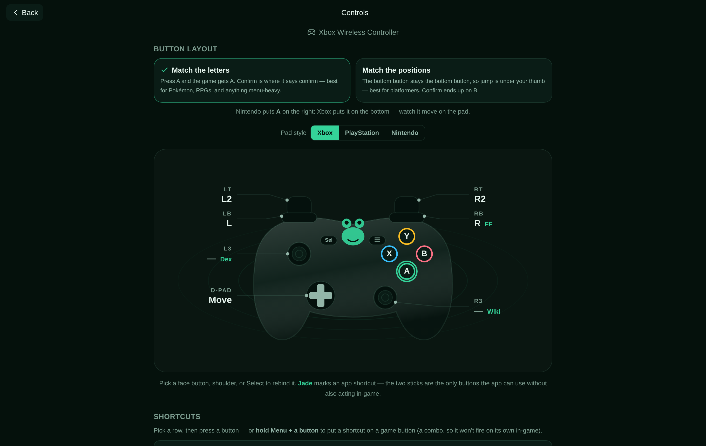

<p align="center">
  
</p>

<h1 align="center">Frog Game Station</h1>

<p align="center"><strong>A self-hosted games browser for your ROM library — play from the couch with a controller, or from your phone with your thumb.</strong></p>

<p align="center">
  <a href="https://github.com/BenGNelson/frog-game-station/actions/workflows/ci.yml"></a>
  
  
  
  
  
  
</p>

Frog Game Station turns a folder of ROMs into a console you can actually enjoy browsing. Point it at a directory and play — no installs, no per-game setup. It organizes and enriches your library, then hands gameplay to an isolated, in-browser [EmulatorJS](https://emulatorjs.org) frame.

<p align="center"></p>

## What it is

The idea: an emulator front-end that's neither a spreadsheet of filenames nor a couch-only kiosk — one library that's genuinely nice to use from the sofa *and* the bus. So it's built for two audiences, both first-class:

- **Couch + controller.** A five-screen, console-style UI you drive entirely with a gamepad (or keyboard): boot → shelf → game list → game page, search anywhere. Rails, cursors, and a letter-at-a-time list keep hundreds of games one flick away — even naming a collection or a save state has an on-screen keyboard, so you never reach for a hardware one.
- **Phone + thumb.** The exact same browser, touch-first: real tap targets on every tile, an on-screen keyboard for search, touch controls in the player, and an installable PWA so you can add it to your home screen and play downloaded games offline.

It has a hand-drawn **frog mascot** and a **WATER / jade dark theme** — a pond motif where things float, reflect, and ripple. And it enriches each game with **[IGDB](https://www.igdb.com)** metadata (cover art, screenshots, summary, genres, rating) via a background matcher, so a bare filename becomes a real game page.

## Features

- **Console-style, not a wall of boxes** — boot → shelf → per-system list → game page, search anywhere. The shelf opens on "Jump back in," so most sessions skip the alphabet; hit "Surprise me" for a random pick.
- **Rich game pages** — a background matcher pulls IGDB art, screenshots, summary, genres, and rating, and suggests **similar titles you *actually own*.** Unmatched ROMs still get a clean cover-and-title page — nothing looks broken.
- **Collections** — sort your library into free-form rails that follow you from couch to phone.
- **Progress that sticks** — play-time is clocked per game, and a **finished** flag badges the ones you've beaten (with a little mascot cheer when you mark one done).
- **ROM-hack aware, with your own covers** — tag a hack of a base game and it borrows the base's art, keeps its own name, wears a **HACK** badge, and links back; or grab a frame mid-game as custom box art for any hack or unmatched title.
- **Save states + battery saves** — battery saves roam and back up server-side; snapshot states carry a thumbnail and can be named, pinned, and relaunched.
- **In-game companions** — over the paused game, pull up a **wiki** (the right page picked per game — a Pokémon walkthrough, a franchise wiki, or a one-tap search for a hack) or, for Pokémon games, a full **Pokédex** (sprites, types, base stats, tappable evolution chains, region-scoped). Both are in-theme, controller-navigable, and reopen right where you left off.
- **Offline + installable PWA** — download games and play offline; a gentle one-time nudge on the phone offers to add it to your home screen (one tap on Android, Share → "Add to Home Screen" on iOS).
- **Real touch controls** — a from-scratch multi-touch overlay with true d-pad diagonals, hit areas bigger than the buttons, adjustable opacity, and a haptic tick on every press (Android).
- **Gamepad-native** — pad, arrow keys, and mouse through one code path. The **Controls** screen draws *your* controller (Xbox / PlayStation / Nintendo): pick whether *A* means the letter or the position, remap any button, and badge app shortcuts onto free buttons.
- **A drawn, living look** — console and mascot art illustrated in-app (no official logos), a rounded display face (Fredoka, bundled — no font CDN) on the wordmark and headings, pond caustics, cover reflections, per-system accents, and true-black OLED on phones. All motion respects `prefers-reduced-motion`.

## Screenshots

|  |  |
|---|---|
|  |  |
| **Game page** — rich IGDB data (summary, genres, rating, developer) with Play / Favorite / Download, plus a save-state shelf. | **Browse** — an alphabetical list with a letter rail and the resting mascot. |

<p align="center"></p>

The in-game **Controls** screen draws your pad as a frog-themed controller — every button
labelled with what it does, the face buttons in their real colours (flip the layout and
watch **A** move between them), app shortcuts (Wiki, Pokédex, Fast Forward) badged on the
buttons that hold them, and any button remappable.

### On a phone

<p align="center">
  
  &nbsp;&nbsp;&nbsp;
  
</p>

Touch-first and installable as a PWA — the same screens adapt from a controller to
a thumb, with an on-screen keyboard for search and touch controls in-game.

## Tech stack

- **Backend:** FastAPI — IGDB client + background matcher, ROM listing/streaming, cover proxy with WebP downscaling, save-state storage. (Python: FastAPI, uvicorn, requests, Pillow.)
- **Frontend:** React + Vite + Tailwind CSS, built to static assets and served by **nginx**.
- **Emulation:** [EmulatorJS](https://emulatorjs.org), loaded into an isolated client-side frame.
- **Metadata:** [IGDB](https://www.igdb.com) (via a Twitch OAuth app token).
- **Packaging:** Docker Compose — frontend + backend + nginx + a named `/data` volume. Installable PWA with offline support.

## Quick start

```bash
git clone <your-fork-url> frog-game-station
cd frog-game-station

# 1. Configure
cp .env.example .env
#    then edit .env:
#      - point ROMS_DIR at your ROM folder (mounted read-only)
#      - optionally add IGDB (Twitch) credentials for rich metadata

# 2. Fetch the EmulatorJS engine (~300MB, not committed)
scripts/fetch-emulatorjs.sh

# 3. Run it
docker compose up -d
```

Then open <http://localhost:8585> (or whatever you set `FRONTEND_PORT` to). On a fresh
install with no games yet, the shelf shows a quiet first-run screen that nudges you toward
the one or two things to set (`ROMS_DIR`, and IGDB credentials for cover art).

The EmulatorJS engine is **not** committed to the repo (it's large and pinned to v4.2.3). `scripts/fetch-emulatorjs.sh` downloads it into `frontend/public/emulatorjs/` (gitignored); alternatively the player can be pointed at the public CDN.

IGDB is optional. Without credentials, Frog Game Station runs fine — every game just shows the basic cover-and-title page. To enable rich metadata, register a free Twitch application and set `IGDB_CLIENT_ID` / `IGDB_CLIENT_SECRET` in `.env`.

## Configuration

All configuration lives in `.env` (copy it from `.env.example`; it is never committed). Secrets live only here.

| Variable | Default | Purpose |
|---|---|---|
| `FRONTEND_PORT` | `8585` | Host port the nginx frontend is published on. |
| `ROMS_DIR` | `./roms` | Path to your ROM folder. Mounted **read-only** into the backend. |
| `IGDB_CLIENT_ID` | *(empty)* | Twitch app client ID for IGDB metadata. Empty = metadata dormant. |
| `IGDB_CLIENT_SECRET` | *(empty)* | Twitch app client secret. Secret — never commit. |
| `IGDB_SYNC_ENABLED` | `true` | Whether the background IGDB matcher runs (no-op without credentials). |
| `IGDB_SYNC_INTERVAL` | `3600` | Seconds between matcher passes. |

The API is mounted at `/api` (backend internal port `8000`). The named `/data` volume holds the SQLite database, WebP art caches, and per-game saves — details in [`docs/ARCHITECTURE.md`](docs/ARCHITECTURE.md).

## Production vs dev

- **Production** (baked images, served by nginx):

  ```bash
  docker compose up -d frontend backend
  ```

- **Hot-reload dev** (Vite dev server, live UI reload):

  ```bash
  docker compose --profile dev up frontend-dev
  ```

The frontend degrades gracefully when the backend is absent, so a lot of UI iteration can happen with just the dev server.

To run Frog Game Station as its **own installable PWA** (its own home-screen icon and offline scope), serve it at its own HTTPS origin — see [`docs/DEPLOY.md`](docs/DEPLOY.md).

## Testing

```bash
scripts/test.sh      # unit suites: pytest (backend) + vitest (frontend)
scripts/verify.sh    # e2e smoke: Playwright drives the app, checks pages render clean
```

## Project layout

```
frog-game-station/
├── backend/            # FastAPI app
│   ├── app/
│   │   ├── igdb.py         # IGDB client (Twitch OAuth + pure helpers)
│   │   ├── igdb_sync.py    # background IgdbMatcher daemon
│   │   ├── images.py       # WebP downscaling / thumbnail cache
│   │   ├── library.py      # ROM listing, streaming, cover matching
│   │   ├── db.py           # SQLite schema + accessors + migrations
│   │   ├── config.py       # settings from env
│   │   └── routers/        # API endpoints (mounted at /api)
│   └── tests/
├── frontend/           # React + Vite + Tailwind
│   ├── src/
│   │   ├── frog/           # the five screens + mascot art + theme
│   │   ├── player/         # EmulatorJS player shell + button legend
│   │   └── lib/            # nav, offline store, hooks, helpers
│   └── public/             # emulator.html, PWA manifest, (emulatorjs/ fetched)
├── e2e/                # Playwright smoke tests
├── scripts/            # test.sh, deploy.sh, verify.sh, fetch-emulatorjs.sh
└── docs/               # ARCHITECTURE.md, TODO.md
```

## Built on

- **[EmulatorJS](https://emulatorjs.org)** — the in-browser emulation engine that runs the games.
- **[IGDB](https://www.igdb.com)** — the games database behind the rich metadata.

Console art is drawn in-app; no official hardware logos or wordmarks are used.

## License

MIT.

<sub><em>AI-assisted build.</em></sub>
