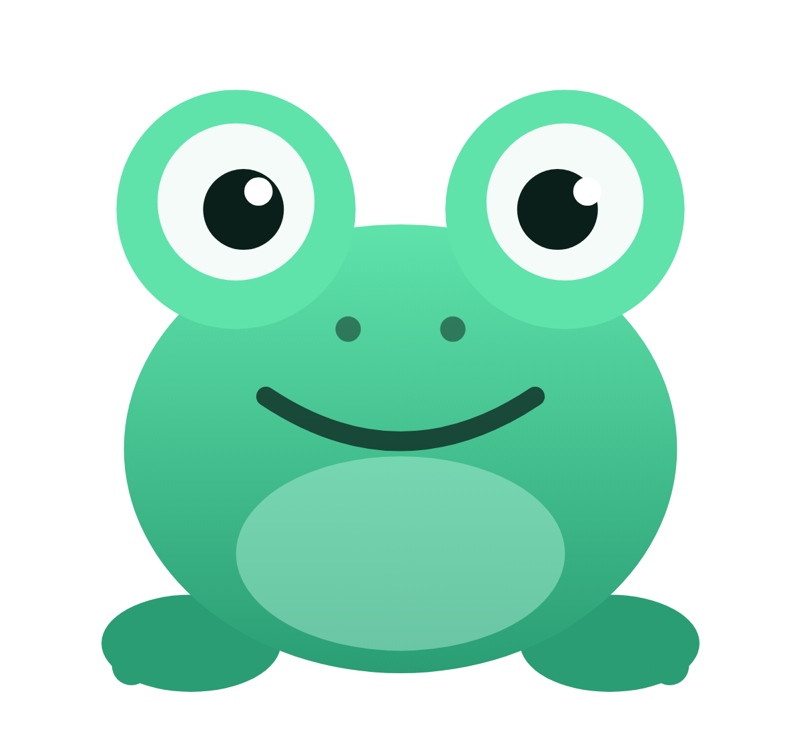
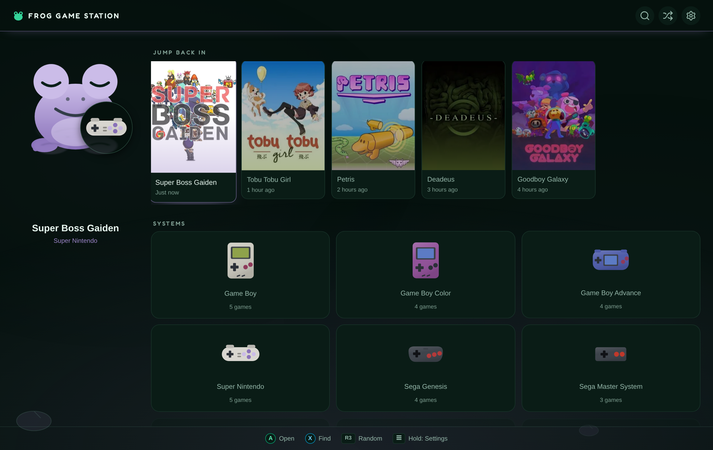
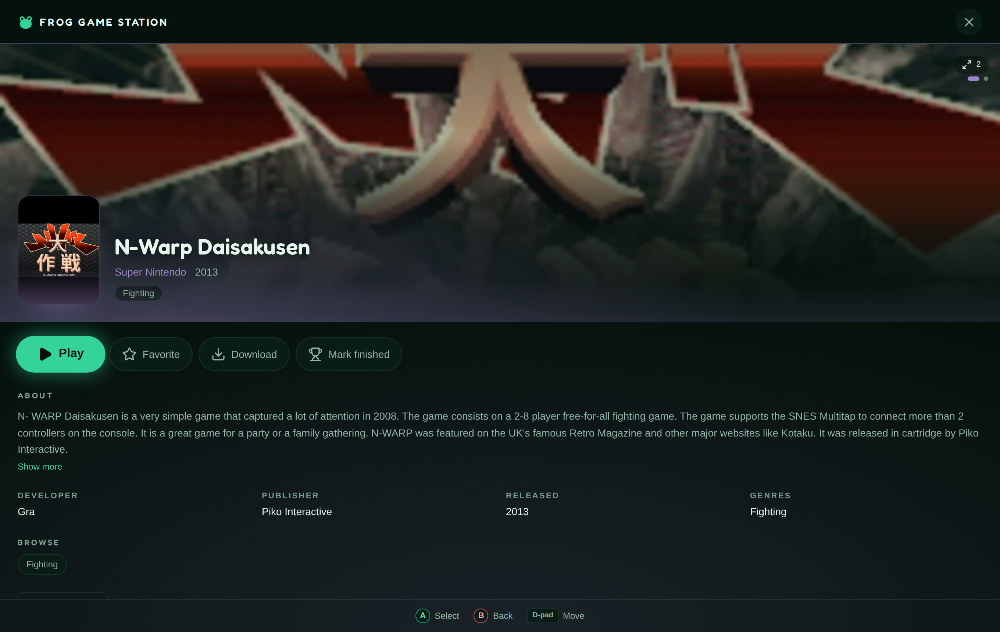
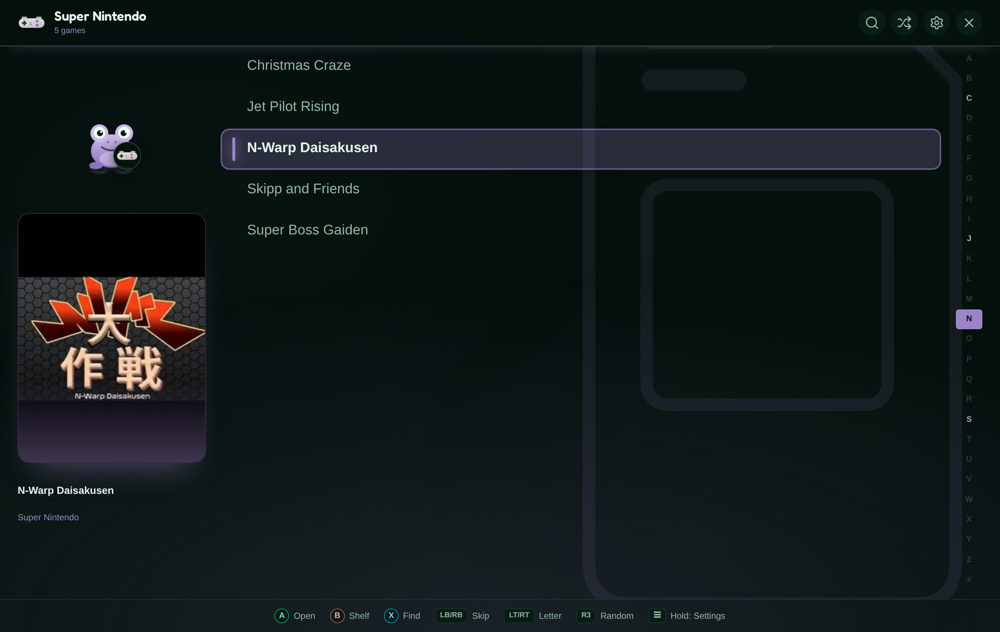
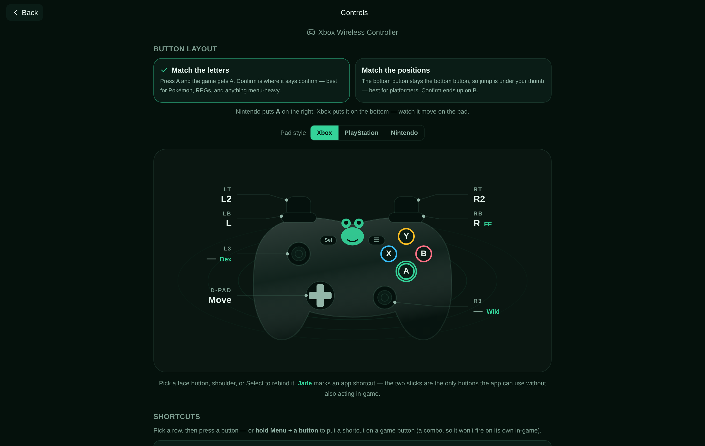
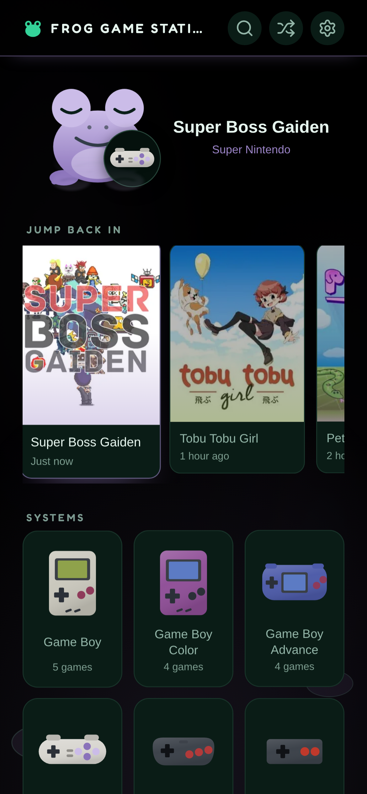
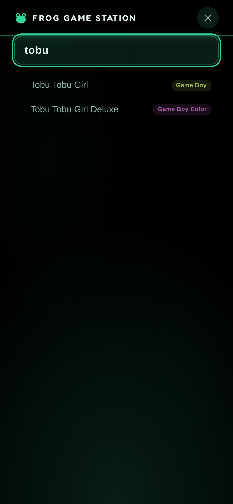

<p align="center">
  
</p>

<h1 align="center">Frog Game Station</h1>

<p align="center"><strong>A self-hosted games browser for your ROM library — play from the couch with a controller, or from your phone with your thumb.</strong></p>

<p align="center">
  <a href="https://github.com/BenGNelson/frog-game-station/actions/workflows/ci.yml"></a>
  
  
  
  
  
  
</p>

Frog Game Station turns a folder of ROMs into a console you can actually enjoy browsing. Point it at a directory and play — no installs, no per-game setup. It organizes and enriches your library, then hands gameplay to an isolated, in-browser [EmulatorJS](https://emulatorjs.org) frame.

<p align="center"></p>

## What it is

The idea: an emulator front-end that's neither a spreadsheet of filenames nor a couch-only kiosk — one library that's genuinely nice to use from the sofa *and* the bus. So it's built for two audiences, both first-class:

- **Couch + controller.** A five-screen, console-style UI you drive entirely with a gamepad (or keyboard): boot → shelf → game list → game page, search anywhere. Rails, cursors, and a letter-at-a-time list keep hundreds of games one flick away — even naming a collection or a save state has an on-screen keyboard, so you never reach for a hardware one.
- **Phone + thumb.** The exact same browser, touch-first: real tap targets on every tile, an on-screen keyboard for search, touch controls in the player, and an installable PWA so you can add it to your home screen and play downloaded games offline.

It has a hand-drawn **frog mascot** and a **WATER / jade dark theme** — a pond motif where things float, reflect, and ripple. And it enriches each game with **[IGDB](https://www.igdb.com)** metadata (cover art, screenshots, summary, genres, rating) via a background matcher, so a bare filename becomes a real game page.

## Features

- **Nine systems** — Game Boy, Game Boy Color, Game Boy Advance, NES, Super Nintendo, Sega Genesis / Master System / Game Gear — and, from the 3D era, **Nintendo 64, Nintendo DS, and PlayStation** (`.chd` discs). Analog stick and C-buttons on pad and touch; the DS's dual screens and touchscreen work with the bottom screen tappable on a phone; PS1 plays out of the box on the emulator's built-in BIOS, or drop in your own `scph5501.bin` for the fussier titles. **Each device only offers what it can actually run**: phones and tablets hide PlayStation and DS (discs outgrow a mobile browser's memory; N64 stays — it genuinely works there). In a desktop *browser* those games are still listed, with their pages and saves — but they play in the **desktop app**, which runs N64, DS, and PlayStation on real native emulator cores.
- **Console-style, not a wall of boxes** — boot → shelf → per-system list → game page, search anywhere. The shelf opens on "Jump back in," so most sessions skip the alphabet; hit "Surprise me" for a random pick.
- **Rich game pages** — a background matcher pulls IGDB art, screenshots, summary, genres, series, and rating, and suggests **similar titles you *actually own*.** Tap a genre or series chip to browse everything you own that wears it. A **Trailer** button plays the game's videos fullscreen in-app (privacy-friendly YouTube no-cookie embed; hidden offline). Unmatched ROMs still get a clean cover-and-title page — nothing looks broken.
- **Collections** — sort your library into free-form rails that follow you from couch to phone. **Favorites and "Jump back in" roam too**: star a game on the TV and it's starred on your phone; play on one device and it's front-and-centre on the next.
- **Progress that sticks** — play-time, session count, and last-played are clocked per game ("Played 3h 20m · 5 sessions · 2 days ago"), and a **finished** flag badges the ones you've beaten (with a little mascot cheer when you mark one done).
- **Rewind & fast-forward** — run time either way from the pause menu or a bound button: rewind scrubs back through the last stretch of play (missed jump, wrong dialogue choice — just back up), fast-forward is the classic turbo with a pickable speed (1.5× to uncapped).
- **CRT filter & screenshots** — a Filter row cycles a curated shader shortlist (CRT scanlines, curved-glass CRT, smooth upscale) for the authentic tube look, and **Save Screenshot** grabs the live frame straight to your camera roll (share sheet on the phone, a `.png` download on the desk).
- **In-game volume** — a Volume row in the pause menu: step the level with the pad or a thumb, tap to mute, remembered across sessions.
- **ROM-hack aware, with your own covers** — tag a hack of a base game and it borrows the base's art, keeps its own name, wears a **HACK** badge, and links back; or grab a frame mid-game as custom box art for any hack or unmatched title.
- **Save states + battery saves** — battery saves roam and back up server-side; snapshot states carry a thumbnail and can be named, pinned, and relaunched.
- **In-game companions** — over the paused game, pull up a **wiki** (the right page picked per game — a Pokémon walkthrough, a franchise wiki, or a one-tap search for a hack) or, for Pokémon games, a full **Pokédex** (sprites, types, base stats, tappable evolution chains, region-scoped). Both are in-theme, controller-navigable, and reopen right where you left off.
- **Offline + installable PWA** — download games and play offline; a gentle one-time nudge on the phone offers to add it to your home screen (one tap on Android, Share → "Add to Home Screen" on iOS).
- **Pond stats** — the library looking back at you: totals and bytes per system, time played with a most-played top five, finished percentage, and what genres your pond actually plays.
- **A real storage manager** — Settings → **Downloads & storage** shows exactly what's on the device (each game with its size, the emulator engine, the app shell, captured saves) reconciled against the browser's own usage figure, with a one-tap **Verify** that audits every stored byte against the downloads list — and per-game or remove-all cleanup.
- **Real touch controls** — a from-scratch multi-touch overlay with true d-pad diagonals, hit areas bigger than the buttons, adjustable opacity, and a haptic tick on every press (Android).
- **Gamepad-native** — pad, arrow keys, and mouse through one code path. The **Controls** screen draws *your* controller (Xbox / PlayStation / Nintendo): pick whether *A* means the letter or the position, remap any button, and badge app shortcuts onto free buttons.
- **A drawn, living look** — console and mascot art illustrated in-app (no official logos), a rounded display face (Fredoka, bundled — no font CDN) on the wordmark and headings, pond caustics, cover reflections, per-system accents, and true-black OLED on phones. The pond is alive: lily pads drift on the shelf, presses ripple, bubbles rise on the loading screens, the mascot's eyes follow your cursor, a firefly visits after bedtime — and leave it idle a few minutes and a **screensaver** takes over, the frog happily catching flies until you press a button. All motion respects `prefers-reduced-motion`.

## Screenshots

|  |  |
|---|---|
|  |  |
| **Game page** — rich IGDB data (summary, genres, rating, developer) with Play / Favorite / Download, plus a save-state shelf. | **Browse** — an alphabetical list with a letter rail and the resting mascot. |

<p align="center"></p>

The in-game **Controls** screen draws your pad as a frog-themed controller — every button
labelled with what it does, the face buttons in their real colours (flip the layout and
watch **A** move between them), app shortcuts (Wiki, Pokédex, Fast Forward, Rewind) badged on the
buttons that hold them, and any button remappable.

### On a phone

<p align="center">
  
  &nbsp;&nbsp;&nbsp;
  
</p>

Touch-first and installable as a PWA — the same screens adapt from a controller to
a thumb, with an on-screen keyboard for search and touch controls in-game.

## Tech stack

- **Backend:** FastAPI — IGDB client + background matcher, ROM listing/streaming, cover proxy with WebP downscaling, save-state storage. (Python: FastAPI, uvicorn, requests, Pillow.)
- **Frontend:** React + Vite + Tailwind CSS, built to static assets and served by **nginx**.
- **Emulation:** [EmulatorJS](https://emulatorjs.org), loaded into an isolated client-side frame.
- **Metadata:** [IGDB](https://www.igdb.com) (via a Twitch OAuth app token).
- **Packaging:** Docker Compose — frontend + backend + nginx + a named `/data` volume. Installable PWA with offline support.

## Quick start

**Prerequisites:** [Docker with Compose v2](https://docs.docker.com/get-docker/) (`docker compose`, not `docker-compose`) and **7-Zip** (`p7zip-full` on Debian/Ubuntu, `p7zip` via Homebrew) for the engine fetch. That's it — no host Node or Python; everything else runs in containers.

```bash
git clone https://github.com/BenGNelson/frog-game-station.git
cd frog-game-station

# 1. Configure
cp .env.example .env
#    then edit .env:
#      - point ROMS_DIR at your ROM folder (mounted read-only)
#      - optionally add IGDB (Twitch) credentials for rich metadata

# 2. Fetch the EmulatorJS engine (~300 MB download — grab a coffee)
scripts/fetch-emulatorjs.sh

# 3. Build and run (the first build compiles the frontend — expect a few minutes)
docker compose up -d
```

Then open <http://localhost:8585> (or whatever you set `FRONTEND_PORT` to). On a fresh
install with no games yet, the shelf shows a quiet first-run screen that nudges you toward
the one or two things to set (`ROMS_DIR`, and IGDB credentials for cover art).

The EmulatorJS engine is **not** committed to the repo (it's large, separately licensed, and pinned to v4.2.3). `scripts/fetch-emulatorjs.sh` downloads it into `frontend/public/emulatorjs/` (gitignored); alternatively the player can be pointed at the public CDN.

IGDB is optional. Without credentials, Frog Game Station runs fine — every game just shows the basic cover-and-title page. To enable rich metadata, register a free Twitch application and set `IGDB_CLIENT_ID` / `IGDB_CLIENT_SECRET` in `.env`.

## Configuration

All configuration lives in `.env` (copy it from `.env.example`; it is never committed). Secrets live only here.

| Variable | Default | Purpose |
|---|---|---|
| `FRONTEND_PORT` | `8585` | Host port the nginx frontend is published on. |
| `API_PORT` | `8586` | Host port the backend API is published on. |
| `DEV_PORT` | `5174` | Host port of the hot-reload dev server (`--profile dev`). |
| `ROMS_DIR` | `./roms` | Path to your ROM folder. Mounted **read-only** into the backend. |
| `BIOS_DIR` | *(unset)* | Optional folder of console BIOS dumps (read-only). Unset = the emulator's built-in HLE BIOS. |
| `SCAN_CACHE_TTL` | `20` | Seconds a library scan is reused before re-walking the ROM folder (`0` disables). |
| `IGDB_CLIENT_ID` | *(empty)* | Twitch app client ID for IGDB metadata. Empty = metadata dormant. |
| `IGDB_CLIENT_SECRET` | *(empty)* | Twitch app client secret. Secret — never commit. |
| `IGDB_SYNC_ENABLED` | `true` | Whether the background IGDB matcher runs (no-op without credentials). |
| `IGDB_SYNC_INTERVAL` | `86400` | Seconds between matcher passes. |
| `WIKI_ENABLED` | `true` | The in-game wiki reader (walkthroughs / franchise wikis over the paused game). |
| `WIKI_PROXY_ALLOW_HOSTS` | *(empty)* | Extra wiki hosts the reader may proxy, beyond the built-in list. |
| `WIKI_CACHE_TTL` | `86400` | Seconds wiki pages are cached server-side. |
| `POKEDEX_ENABLED` | `true` | The in-game Pokédex companion (PokeAPI-backed). |

The API is mounted at `/api` (backend internal port `8000`). The named `/data` volume holds the SQLite database, WebP art caches, and per-game saves — details in [`docs/ARCHITECTURE.md`](docs/ARCHITECTURE.md).

## Production vs dev

- **Production** (baked images, served by nginx):

  ```bash
  docker compose up -d frontend backend
  ```

- **Hot-reload dev** (Vite dev server, live UI reload):

  ```bash
  docker compose --profile dev up frontend-dev
  ```

The frontend degrades gracefully when the backend is absent, so a lot of UI iteration can happen with just the dev server.

## Install it as an app (PWA)

Frog Game Station is an installable PWA: on your home screen it opens fullscreen (no
browser chrome) and downloaded games play offline.

1. **Serve it over HTTPS at its own hostname.** Browsers only install PWAs from a
   secure origin — plain LAN HTTP won't offer it. The easiest paths are a
   [Tailscale](https://tailscale.com) HTTPS route or a reverse proxy (Caddy/nginx)
   with a certificate; the step-by-step runbook is [`docs/DEPLOY.md`](docs/DEPLOY.md).
2. **Open that HTTPS URL on the device and install:**
   - **iPhone / iPad (Safari):** Share button → **Add to Home Screen** → Add.
   - **Android (Chrome):** tap the **Install** prompt, or ⋮ menu → **Add to home screen**.
   - **Desktop (Chrome/Edge):** click the install icon at the right end of the address bar.
3. Launch it from the icon — the app also offers a gentle one-time install nudge on
   phones, so step 2 mostly happens by itself.

## Desktop app (beta)

The same frontend also runs as a native desktop window (Tauri), pointed at your
self-hosted backend — the first step of the native desktop app (which will
eventually play the disc-era systems browsers can't). For now it's the full
browsing/playing UI in a real window; gameplay still uses the built-in web player.

Requirements: [Node](https://nodejs.org), [Rust](https://rustup.rs), and the
EmulatorJS engine fetched (`scripts/fetch-emulatorjs.sh`).

```bash
cd frontend
npm ci
# point the app at your backend (this file is gitignored — real URLs never land in git)
echo 'VITE_API_BASE=http://your-server:8585/api' > .env.desktop.local
npm run tauri dev              # dev loop: native window + hot reload
npm run tauri build            # a real .app / installer bundle
```

**N64 plays natively** in the desktop app (v0.8.0): a real libretro core rather
than the in-browser engine, drawn on a GL surface with the app's own pause menu,
save shelf, and Controls screen floating over it — and its saves roam to your
phone through the same endpoints the web player uses. Fetch the cores first with
`scripts/fetch-native-cores.sh` (pinned by checksum; nothing is committed). Every
other system still plays through the built-in web player; DS and PlayStation join
the native side next.

The desktop build strips the PWA machinery (no service worker, no install nudge,
no offline-download button — the app is already installed and local). The backend
allows the desktop app's webview origins out of the box; see `CORS_ALLOW_ORIGINS`
in `.env.example` to restrict that. One dev-loop wrinkle: `tauri dev` serves the
UI from Vite (`http://localhost:5173`), so add that origin to the backend's
`CORS_ALLOW_ORIGINS` while developing — the built app needs nothing.

## Testing

```bash
scripts/test.sh      # unit suites: pytest (backend) + vitest (frontend)
scripts/verify.sh    # e2e smoke: Playwright drives the app, checks pages render clean
```

## Project layout

```
frog-game-station/
├── backend/            # FastAPI app
│   ├── app/
│   │   ├── igdb.py         # IGDB client (Twitch OAuth + pure helpers)
│   │   ├── igdb_sync.py    # background IgdbMatcher daemon
│   │   ├── images.py       # WebP downscaling / thumbnail cache
│   │   ├── library.py      # ROM listing, streaming, cover matching
│   │   ├── db.py           # SQLite schema + accessors + migrations
│   │   ├── config.py       # settings from env
│   │   └── routers/        # API endpoints (mounted at /api)
│   └── tests/
├── frontend/           # React + Vite + Tailwind
│   ├── src/
│   │   ├── frog/           # the five screens + mascot art + theme
│   │   ├── player/         # EmulatorJS player shell + button legend
│   │   └── lib/            # nav, offline store, hooks, helpers
│   └── public/             # emulator.html, PWA manifest, (emulatorjs/ fetched)
├── e2e/                # Playwright smoke tests
├── scripts/            # test.sh, deploy.sh, verify.sh, fetch-emulatorjs.sh
└── docs/               # ARCHITECTURE.md, THEME.md (the design system), TODO.md
```

## Built on

- **[EmulatorJS](https://emulatorjs.org)** — the in-browser emulation engine that runs the games (GPL-3.0; its bundled libretro cores carry their own per-core licenses).
- **[IGDB](https://www.igdb.com)** — the games database behind the rich metadata (accessed with your own API credentials).
- **[libretro-thumbnails](https://github.com/libretro-thumbnails/libretro-thumbnails)** — the community box-art collection covers are matched from.
- **MediaWiki-based community wikis** — the in-game wiki reader displays article content from community wikis (Bulbapedia, Fandom, and others), which is licensed by those communities under Creative Commons terms (typically CC BY-SA) and always linked back to its source.
- **[PokeAPI](https://pokeapi.co)** — the data behind the in-game Pokédex companion.

Console art is drawn in-app; no official hardware logos or wordmarks are used.

## ROMs, BIOS & legality

- **No games are included, linked, or downloaded by this project.** Frog Game Station
  is a front-end for a ROM folder *you* provide. Only play backups of games you
  legally own, and check the law where you live — downloading games you don't own is
  copyright infringement in most places.
- **No console BIOS files are included or fetched.** Systems that can use one (e.g.
  PlayStation) run on the emulator's built-in high-level BIOS by default; if you drop
  in a real BIOS dump, it must come from your own console.
- **No emulators are distributed by this repository.** The EmulatorJS engine (and the
  emulator cores inside it) is fetched separately from its own project at install
  time, pinned by version, and never committed here.
- **Trademarks:** Frog Game Station is not affiliated with, endorsed by, or sponsored
  by Nintendo, Sega, Sony, or any other console manufacturer or game publisher.
  Console and game names appear only to describe compatibility; all trademarks are
  the property of their respective owners.

## License

The code in this repository is **MIT** ([LICENSE](LICENSE)).

That covers this project's own code only. The separately-downloaded EmulatorJS engine
is **GPL-3.0**, and the libretro emulator cores it bundles each carry their own
licenses (several are non-commercial). They are not part of this repository, are
never linked into the app (the engine runs in an isolated frame), and their licenses
are not changed by this project's MIT license.

<sub><em>AI-assisted build.</em></sub>
